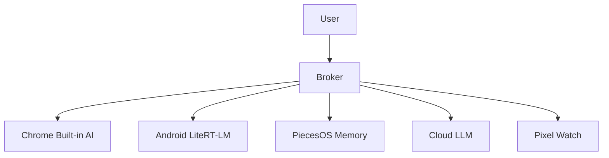

# PCOS — Personal Context Operating System

> A local-first hybrid AI runtime across Chrome, Android, Pixel Watch, PiecesOS, and cloud LLMs.

## What is PCOS?

PCOS is not a chatbot. It is a **context router** — a deterministic system that coordinates multiple specialized local AI models, memory systems, devices, and tools into one coherent cognitive runtime while keeping latency low and preserving privacy.

## Key Principles

- **Local-first**: Tasks run on-device (Chrome, Android) whenever possible
- **Privacy-preserving**: Sensitive data never leaves the device
- **Memory before inference**: PiecesOS LTM is queried before generating responses
- **Cloud as last resort**: Cloud LLMs are only used when local models can't handle the task
- **Deterministic routing**: No LLM reasoning for routing — just policy-based dispatch

## Quick Start

```bash
pip install -r requirements.txt
uvicorn broker.main:app --reload --port 8000
```

## Five Planes

| Plane | Surface | Role |
|---|---|---|
| Browser | Chrome | Page-grounded NLP transforms, side panel UI |
| Device | Android + LiteRT-LM | Private offline inference, function calling |
| Memory | PiecesOS | Episodic LTM, MCP, workflow context |
| Ambient | Pixel Watch | Lightweight context signals, quick actions |
| Cloud | Gemini / OpenAI | Overflow reasoning, long context only |

## Architecture



See [Architecture](architecture.md) for details.
